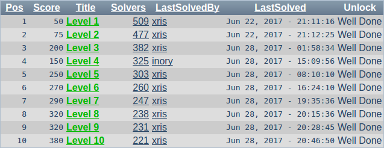

# RedTiger's Hackit

一共10题的SQL注入，考察还是挺全面的，有最基本的万能密码，有`UNION SELECT`注入，有基于Boolean的盲注，有基于报错的注入，也有对`INSERT`和`UPDATE`的注入。

因为主要方向就是SQL注入，所以难度都很低，稍微有点基础即可轻松过关。但是在WeChall上的分数又非常高，十题完成有将近1W5分，超值。

反正不是很长，多半会扔到博客上。

